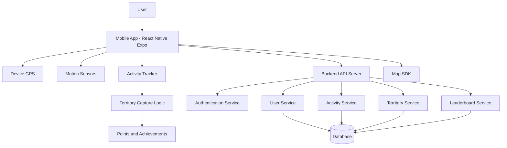
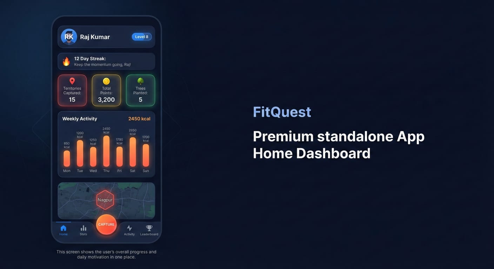
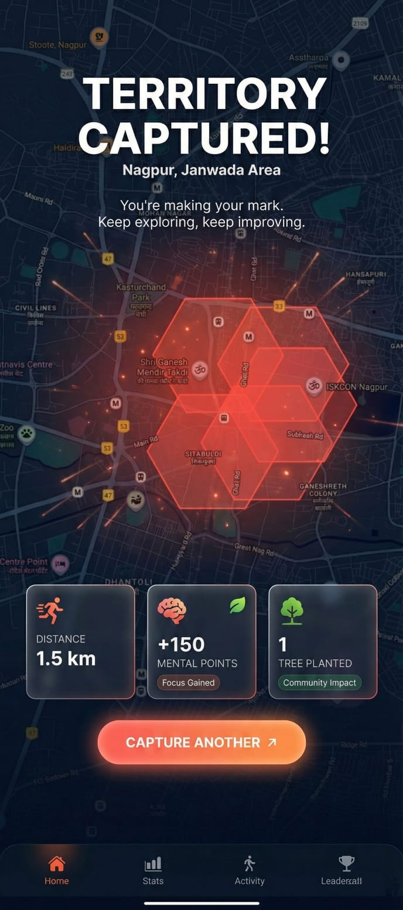
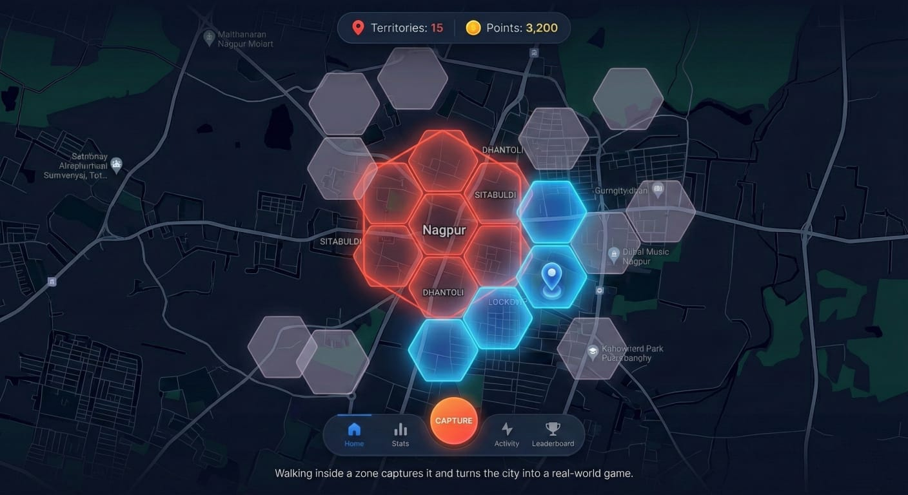
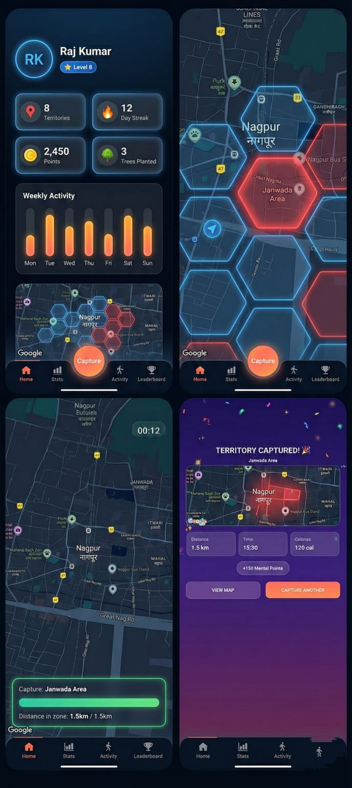

# FitQuest

**Turn your daily walks into an adventure. Capture territories, compete with friends, and stay fit.**

---

## The Problem

Most fitness apps are boring. They track steps and calories, but they don't make exercise feel exciting. People lose motivation quickly because there's no real engagement beyond numbers on a screen.

Walking and running should feel like an adventure, not a chore. We needed something that turns physical activity into a game you actually want to play.

---

## Our Solution

FitQuest is a gamified fitness app that transforms your neighborhood into a playable map. As you walk or run through different areas, you capture territories and earn points. The more you move, the more you own.

It combines fitness tracking with real-world exploration and friendly competition. Every step counts toward claiming new territories and climbing the leaderboard.

---

## System Architecture

---

## Key Features

### Home Dashboard

Your personal fitness command center. See your weekly stats, activity goals, and current progress at a glance. Simple, clean, and motivating.

### Mobile Experience

Built for on-the-go tracking. Whether you're walking to work or going for a run, FitQuest works seamlessly on your phone. Real-time updates as you move.

### Territory Capture

This is where the game happens. Your city is divided into hexagonal territories. Walk or run through an area to capture it. Complete the circuit, and it's yours. Other users can see who owns what, creating a competitive map that updates in real-time.

### Reward System

Every territory captured earns you points. Track your achievements, see your stats, and compete on the leaderboard. The system recognizes consistency with streak bonuses and milestone rewards.

---

## All Screens Overview

Here's how everything comes together. From the home screen to activity tracking to the leaderboard, FitQuest offers a complete experience that keeps you engaged.

---

## Tech Stack

**Frontend:**
- React Native with Expo
- React Navigation for smooth screen transitions
- React Native Maps for territory visualization

**Location Services:**
- Expo Location for real-time tracking
- GPS-based territory detection

**Styling:**
- React Native Linear Gradient for modern UI
- Custom components with consistent design system

---

## Why This Project Matters

Fitness apps are everywhere, but most people stop using them after a few weeks. FitQuest tackles the motivation problem by making movement feel like gameplay.

**Real Impact:**
- Gets people moving who normally wouldn't exercise
- Turns solo activities into social competition
- Makes exploring your neighborhood rewarding
- Creates lasting habits through game mechanics

When fitness feels like a game, people stick with it. That's the difference FitQuest makes.

---
## How to Run 

**Quick Start:**

1. Clone the repository
2. Install dependencies: `npm install`
3. Start the app: `npm start`
4. Scan the QR code with Expo Go (mobile) or press `w` for web

**Requirements:**
- Node.js installed
- Expo CLI (will be installed with dependencies)
- Expo Go app on your phone (for mobile testing)

**First Launch:**
- Grant location permissions when prompted
- Explore the map to see territories
- Start an activity to begin capturing

---

## Future Scope

**Short-term Improvements:**
- Add friend system for direct challenges
- Integrate wearable device support
- Team-based territory battles
- Custom territory shapes and sizes

**Long-term Vision:**
- Real rewards from local businesses
- Community events and group challenges
- Health data integration
- Global leaderboards with regional rankings

We built the foundation. The possibilities are endless.

---

## Credits

Built during a hackathon by developers who believe fitness should be fun.

Special thanks to the open-source community for the tools and libraries that made this possible.

---

**FitQuest: Own your neighborhood, one step at a time.**
